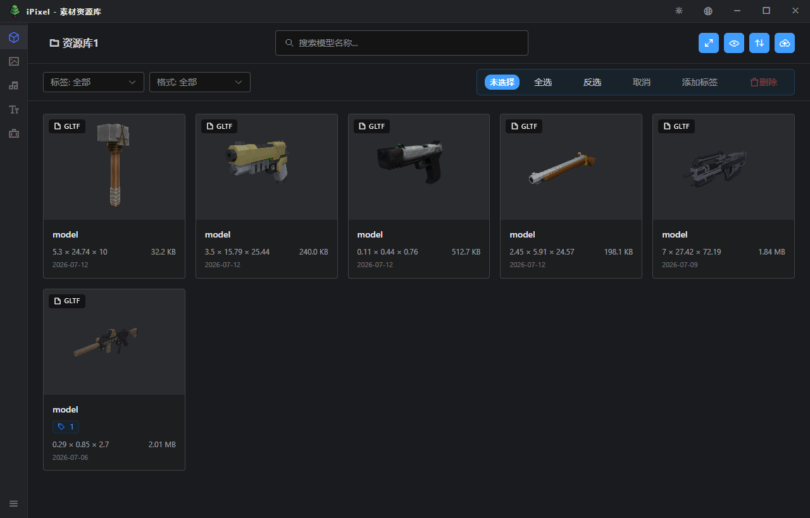
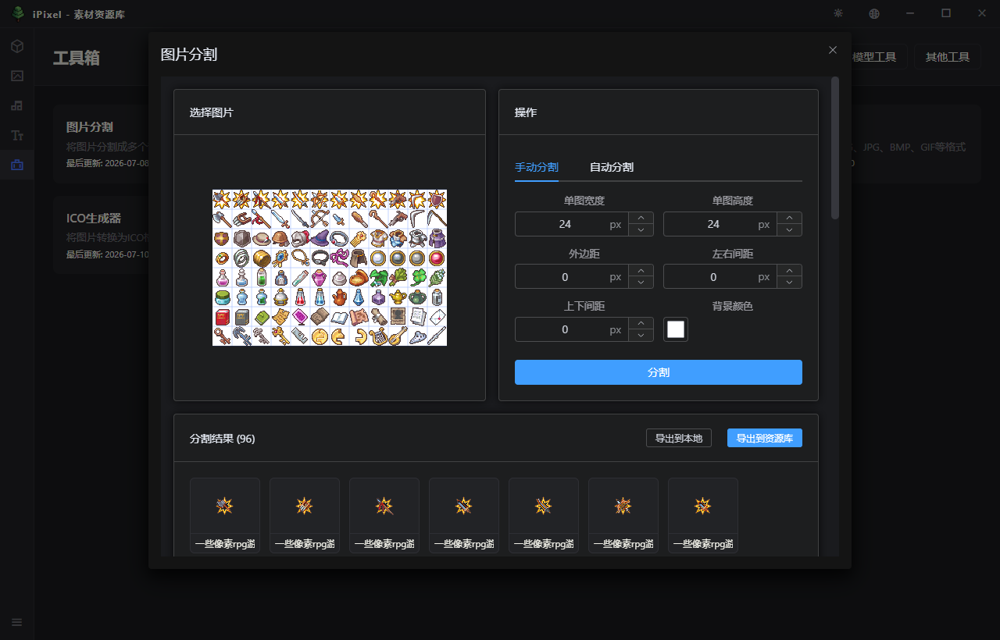

# ipixel

  <a href="README.md">中文</a> | <a href="README.en.md">English</a>

## About

iPixel is a desktop application focused on local asset management, providing efficient and secure digital resource management solutions for designers, creators, and developers. It supports multiple asset types including images, audio, fonts, and 3D models, with all data stored locally to protect privacy.

## Screenshots

## Target Users

Designers, artists, video/audio designers, content creators, game developers, UI/UX designers, and other professionals who need to manage large volumes of digital assets.

## Features

- Dedicated preview and management features for each asset type
- Independent storage modules for image, model, font, and audio libraries for faster resource organization
- Tag system for quick marking and retrieval
- Customizable display fields to show asset information on demand
- Detailed information panel showing file metadata
- Filter by name, tag, format, and other dimensions
- Quick locate target assets
- Dark/light theme switching for different usage scenarios
- Multi-language support
- Customizable display fields for personalized interface layout
- Complete operation log recording with detailed viewing support
- Device information monitoring for one-click viewing of CPU, memory, system version, etc.
- All data stored locally, no internet connection required
- No user data collection, high priority on privacy protection

## Supported Formats

Images: PNG, JPG, JPEG, BMP, WebP, GIF, TGA
Audio: MP3, WAV, OGG, FLAC, AAC, M4A
Fonts: TTF, OTF, WOFF, WOFF2
Models: GLB, GLTF, OBJ, STL, JSON, FBX

- Metadata: SQLite database (imodel.db) for storing resource metadata
- File storage: Sharded storage by SHA256 hash value in models/XX/ and images/XX/ directories (XX is the first two hash characters, 00-ff)
- Resource ID: SHA256 hash value ensures uniqueness
- Library configuration: library.json stores basic library information

## System Requirements

- Windows 10+ / macOS 10.15+ / Linux
- Node.js 18+

## Usage Guide

1. First launch: Select "Create New Library" to create an empty library, or "Open Library" to select an existing one
2. Upload resources: Click the "Upload" button, supporting single upload (with detailed editing) or batch upload
3. Preview resources: Click on resource cards to enter the detail page
4. Edit information: Modify name, description, and tags on the detail page
5. Search and filter: Use the top search box and tag/format filters to quickly locate resources
6. Switch resource types: Use the left sidebar to switch between model, image, audio, and font libraries